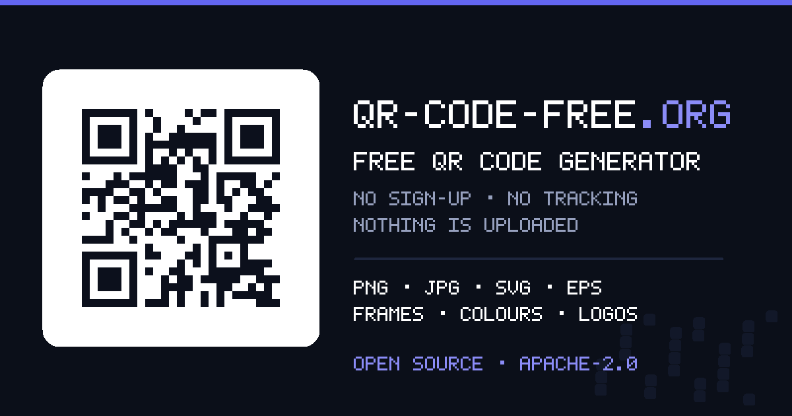

# qr-code-free.org

A free QR code generator that runs entirely in the browser. No accounts, no tracking, no
server, no dependencies, no build step — a static page you can host anywhere for nothing.

**Live: [qr-code-free.org](https://qr-code-free.org)**



## What it does

- **10 content types** — link, plain text, e-mail, phone, SMS, WhatsApp, Wi-Fi, vCard
  contact card, calendar event and location.
- **12 customisable frames** with your own caption, frame colour and caption colour:
  caption below or above, card on a panel, thin outline, label on the border, arrow,
  corner brackets, speech bubble, ticket, phone and ribbon.
- **Shapes and colours** — four module shapes, four corner-eye shapes, any colour pair,
  tested presets, and an optional transparent background.
- **Logo in the centre**, with a padded clear area and a warning when it eats more error
  correction than the level can afford.
- **Downloads: PNG, transparent PNG, JPG, WebP, SVG, PDF and EPS.** Pick a format and the
  preview becomes that exact file, so you see what you are about to save. The preview is a
  plain ``, so right-click → *Save image as…* and drag-and-drop work as you would
  expect. Bitmap formats are offered only when the browser can really encode them — a
  browser asked for AVIF today quietly returns a PNG, so AVIF appears only once that
  changes. PDF and EPS are documents that no browser renders inline, so for those two the
  preview keeps showing the PNG while the download stays vector.
- **A scan report**: symbol version, module count, the error correction level actually
  used, the live contrast ratio and the smallest size the code should ever be printed.
- **Practical guidance** on the page: the 10:1 size rule with a calculator, contrast,
  logos versus error correction, and a print and test checklist.

Everything is computed locally. Your text, your logo and your settings never leave the
browser tab; the page makes no network requests after it loads and works offline.

## How it is built

No frameworks, no bundler, no `node_modules` at runtime. Five files do the work:

| File | Responsibility |
| --- | --- |
| `assets/js/qr.js` | QR encoder (ISO/IEC 18004): mode selection, Reed–Solomon error correction, all 40 versions, masking |
| `assets/js/payloads.js` | Content types: form schema plus the string each one encodes, with escaping |
| `assets/js/scene.js` | Turns a QR matrix plus styling into resolution-independent drawing primitives, including the frames |
| `assets/js/renderers.js` | Draws a scene as SVG, canvas (PNG/JPG/WebP), PDF or EPS |
| `assets/js/app.js` | The user interface |

The single `scene.js` model is why every export format looks identical: bitmaps, SVG, PDF
and EPS all consume the same primitive list, so a frame is implemented once rather than
six times. EPS is emitted as PostScript Level 2 and PDF as PDF 1.4, both vector, both
clipped to the bounding box, with Helvetica re-encoded to Latin-1 so accented captions
survive. PDF embeds the logo as a JPEG XObject; EPS cannot hold a bitmap at all, which the
interface tells you when it matters.

### The encoder is verified, not just tested

`assets/js/qr.js` was written from the specification for this project. Before the golden
hashes in `test/qr.test.mjs` were locked in, its output was compared **module for module
against an independent reference implementation** across all 40 symbol versions, all four
error correction levels, all three character modes and multiple mask patterns (1440
matrices, byte-identical), and all 480 entries of the published character-capacity table
were reproduced exactly. Generated symbols were additionally decoded back with an
independent decoder.

`npm test` covers the encoder (capacity tables, function patterns, format-information
round-trip, golden symbols), the payload builders and the renderers. EPS and PDF get
special treatment. `test/eps.test.mjs` *executes* the generated PostScript with a small
interpreter for the operator subset the renderer emits, catching an unbalanced operand or
graphics stack and any mark outside the declared bounding box. `test/pdf.test.mjs` walks
the cross-reference table the way a reader does, checking that every offset lands on its
object and that each `/Length` matches the bytes actually written. Neither problem is
visible by reading the file.

One note from that exercise, in case it saves you a day: the alignment-pattern table in
ZXing (and the ports derived from it) lists version 23 as `6, 30, 54, 74, 102`. The
standard, and every encoder that follows it, uses `78` rather than `74`. Codes this
generator produces at version 23 are correct; ZXing-derived *decoders* are the ones that
cannot read them.

## Running it locally

```bash
git clone https://github.com/spidfire/qr-code-free-org.git
cd qr-code-free-org
python3 -m http.server 8080      # or: npm run serve
# open http://localhost:8080
```

Any static file server works. There is nothing to compile.

```bash
npm test                         # node --test test/ — no dependencies
npm run images                   # regenerate og-image.png, apple-touch-icon.png, favicon.svg
```

`tools/make-images.mjs` draws the social card and icons from scratch with a small PNG
writer and a 5×7 pixel font, so images stay reproducible without an image library.

## Hosting it yourself

The repository root *is* the site. Copy it to any static host — GitHub Pages, Cloudflare
Pages, Netlify, S3, nginx — and you are done. `.github/workflows/deploy.yml` runs the
tests and publishes to GitHub Pages on every push to `main`; `CNAME` points at the custom
domain, so change or delete that file for your own deployment. If you host somewhere other
than `qr-code-free.org`, also update the absolute URLs in `index.html` (canonical link,
Open Graph tags, JSON-LD) and in `sitemap.xml` and `robots.txt`.

## Deliberately missing

**Dynamic QR codes and scan statistics.** Both need a server that every scan passes
through: hosting to pay for, an account to manage, and a printed code that dies when that
service does. This project is a static page on purpose. If you want to change a
destination later, point the code at a short path on your own domain and redirect from
there — you keep control, and the code stays free.

**File uploads** (PDF, images, video) for the same reason: hosting your file would mean a
server and a bill. Host the file yourself and encode the link.

## Licence

Licensed under the [Apache License 2.0](LICENSE) — commercial use, modification and
redistribution are all fine, provided you keep the licence and the [NOTICE](NOTICE).
The page text and documentation are offered under the same licence.

There is no third-party code in this repository.

"QR Code" is a registered trademark of DENSO WAVE INCORPORATED, which is not affiliated
with this project. The symbol format is standardised as ISO/IEC 18004 and free to use.
**The QR codes you generate carry no licence from this project at all** — they are yours.
